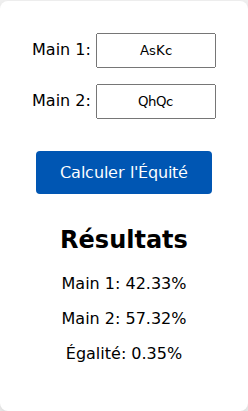

# Calculateur d'Équité de Poker

Un simple calculateur d'équité de poker en version web, similaire à Equilab, construit en JavaScript pur et utilisant la bibliothèque `pokersolver`.

## Capture d'écran

Voici à quoi ressemble l'application lorsqu'elle calcule l'équité entre deux mains :

## Fonctionnalités

-   **Calcul d'équité pré-flop** : Entrez deux mains (par exemple, `AsKd` et `QhQc`) pour voir leurs chances de gagner.
-   **Simulation Monte Carlo** : L'application exécute 10 000 simulations de boards aléatoires pour une estimation précise de l'équité.
-   **Interface simple** : Une interface claire et facile à utiliser pour obtenir des résultats rapidement.
-   **Évaluation de main robuste** : Utilise la bibliothèque `pokersolver` pour une évaluation des mains fiable et éprouvée.

## Comment l'utiliser

1.  Clonez ou téléchargez ce dépôt.
2.  Ouvrez le fichier `index.html` dans votre navigateur web.
3.  Entrez les deux mains que vous souhaitez comparer dans les champs de saisie. Le format est `RangCouleurRangCouleur` (par exemple, `AsKd` pour As de Pique et Roi de Carreau).
    -   Rangs : `A, K, Q, J, T, 9, 8, 7, 6, 5, 4, 3, 2`
    -   Couleurs : `s` (pique), `h` (cœur), `d` (carreau), `c` (trèfle)
4.  Cliquez sur le bouton "Calculer l'Équité".
5.  Les résultats s'afficheront en dessous.

## Stack Technique

-   **Frontend** : HTML5, CSS3, JavaScript (ES6+)
-   **Logique Poker** : [PokerSolver.js](https://github.com/goldfire/pokersolver) pour l'évaluation des mains.
-   **Aucune dépendance de build** : Le projet peut être exécuté directement dans le navigateur sans aucune étape de compilation.
